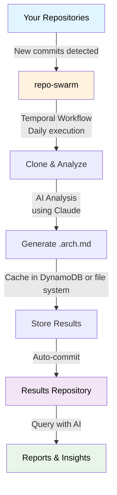

# RepoSwarm🤖


🎬 **Architecture Overview (click to play)**  
[](https://www.youtube.com/watch?v=rOMf9xvpgtc)

RepoSwarm is an AI powered multi-repo architecture discovery platform that generates its output in a specialized output repository that you can use for agent context.

see example results repo at [repo-swarm-sample-results-hub](https://github.com/royosherove/repo-swarm-sample-results-hub).

## Credits

RepoSwarm was born out of a hackathon we ran at Verbit, in which our team, comprised of [Moshe](https://github.com/mosher), [Idan](https://github.com/Idandos) and [Roy](https://github.com/royosherove) created this project together.

## What's This For?

RepoSwarm is an intelligent agentic-like engine that:

- 🔍 Analyzes GitHub repositories using Claude Code SDK
- 📝 Generates standardized `.arch.md` architecture files
- 🔄 Runs daily via Temporal workflows on repos with new commits
- 💾 Caches results to avoid redundant analysis
- Writes the results into a results repository that you configure

📋 **See it in action**: Check out [RepoSwarm's self-analysis report](https://github.com/royosherove/repo-swarm-sample-results-hub/blob/main/repo-swarm.arch.md) - an example of RepoSwarm investigating its own codebase!

## How It Works

RepoSwarm runs as a Temporal workflow that automatically processes repositories and feeds a configured targer repository.



🔗 **Analysis prompts**: [prompts/shared](prompts/shared) - The AI prompts used to understand your codebases
🏗️ **Generated docs**: [repo-swarm-sample-results-hub](https://github.com/royosherove/repo-swarm-sample-results-hub) - Where the `.arch.md` files end up

## Quick Start

### Prerequisites

- Python 3.12+
- Claude authentication (API key or OAuth token)

### Claude Authentication Options

RepoSwarm supports two authentication methods for Claude API access:

#### Option 1: OAuth Token (Claude Max Subscription) - Recommended

If you have a Claude Max subscription, you can use OAuth authentication which provides access to Claude Max models.

**Setup Steps:**

1. **Generate OAuth token**:

   ```bash
   mise claude-login
   ```

   This runs the official Claude CLI `setup-token` command and generates an OAuth token.

2. **Add token to `.env.local`**:

   ```bash
   CLAUDE_CODE_OAUTH_TOKEN=sk-ant-oat01-...
   ```

   Copy the token displayed by `claude setup-token` into your `.env.local` file.

3. **Verify authentication**:
   ```bash
   mise claude-status
   ```
   This command shows your current authentication method and token status.

**Benefits of OAuth:**

- ✅ Access to Claude Max models (if you have a subscription)
- ✅ Uses official Claude CLI (ToS compliant)
- ✅ Long-lived tokens (1 year validity)
- ✅ No API key management needed

#### Option 2: API Key Authentication

For users without Claude Max subscription, use the standard Anthropic API key.

**Setup Steps:**

1. **Get API key** from [Anthropic Console](https://console.anthropic.com/)

2. **Add to `.env.local`**:

   ```bash
   ANTHROPIC_API_KEY=sk-ant-api03-...
   ```

3. **Verify authentication**:
   ```bash
   mise claude-status
   ```

**Benefits of API Key:**

- ✅ Works with standard Anthropic API tier
- ✅ Direct SDK integration (faster)
- ✅ Suitable for CI/CD and production environments

#### Authentication Priority

RepoSwarm checks credentials in this order:

1. `CLAUDE_CODE_OAUTH_TOKEN` (highest priority)
2. `CLAUDE_OAUTH_TOKEN` (alternative OAuth variable)
3. `ANTHROPIC_API_KEY` (fallback)

#### Troubleshooting Authentication

**Check authentication status:**

```bash
mise claude-status
```

**Common Issues:**

- **"No Claude authentication credentials found"**
  - Ensure `.env.local` exists and contains either `CLAUDE_CODE_OAUTH_TOKEN` or `ANTHROPIC_API_KEY`
  - Run `mise claude-login` for OAuth setup
  - Or get API key from https://console.anthropic.com/

- **"Invalid token format"**
  - OAuth tokens must start with `sk-ant-oat01-`
  - API keys must start with `sk-ant-api03-`
  - Verify token was copied correctly (no extra spaces)

- **"Token expired"**
  - OAuth tokens: Run `mise claude-login` to generate a new token
  - API keys: Check expiration in Anthropic Console and regenerate if needed

- **"Authentication method not working"**
  - Verify token is valid: `mise claude-status`
  - Check rate limits in Anthropic dashboard
  - Ensure correct environment variable name in `.env.local`

### Installation

**Install mise** (tool version manager):

```bash
# macOS
brew install mise

# Linux/WSL
curl https://mise.run | sh
```

**🚀 Run the setup wizard** (recommended):

```bash
# Interactive setup wizard - sets up everything automatically
mise get-started
```

This wizard will:

- ✅ Create your `.env.local` file
- ✅ Configure your Claude API key
- ✅ Set up GitHub integration (optional)
- ✅ Configure Architecture Hub repository
- ✅ Set up git user details

**Manual setup** (alternative):

```bash
# Copy local environment template
cp env.local.example .env.local

# Edit .env.local with your Claude API key
# ANTHROPIC_API_KEY=your_key_here
```

**Install dependencies**:

```bash
mise install
mise run dev-dependencies
```

### Running RepoSwarm

#### Recommended: Full Local Testing

```bash
# Analyze repositories and generate .arch.md files
# Uses file-based storage (no AWS required)
mise investigate-all
```

This command:

- ✅ Loads configuration from `.env.local`
- ✅ Uses file-based storage (no DynamoDB required)
- ✅ Automatically starts Temporal server and worker
- ✅ Analyzes repositories from `src/prompts/repos.json`
- ✅ Stores `.arch.md` files in `temp/` directory

#### Test Single Repository

```bash
# Test a specific repository
mise investigate-one https://github.com/user/repo

# Or use predefined repos
mise investigate-one hello-world
```

## Configuration

### GitHub Fine-Grained Personal Access Tokens

RepoSwarm supports three GitHub token types: CLASSIC (`ghp_`), FINE*GRAINED_USER (`ghu*`), and FINE_GRAINED_PAT (`github*pat*`). Fine-grained PATs are recommended for better security.

**Benefits of fine-grained tokens**

- **Security**: narrower scopes reduce blast radius
- **Granular permissions**: per-repo access with explicit permissions
- **Expiration control**: set and enforce token lifetimes

#### Generate a fine-grained PAT

1. In GitHub, go to **Settings** → **Developer settings**.
2. Select **Personal access tokens** → **Fine-grained tokens**.
3. Click **Generate new token**.
4. Set a **Token name** and **Expiration**.
5. Under **Repository access**, choose **All repositories** or **Only select repositories**, then pick the repos RepoSwarm will analyze.
6. Under **Permissions**, set:
   - **Contents**: Read and write
   - **Metadata**: Read-only
7. Click **Generate token** and copy the token value.

**Note:** Optional screenshots can live in `docs/screenshots/` if you want to add a visual walkthrough later.

#### Required permissions

- **Contents**: Read and write
- **Metadata**: Read-only

#### Troubleshooting permission errors

- **"Resource not accessible by personal access token"**: confirm the repo is included under **Repository access** and permissions match the list above.
- **"Not Found" or "Repository not found"**: the token lacks access to the repo or the repo is in a different org; update **Repository access** and verify org membership.
- **"Requires write access to contents"**: ensure **Contents** is set to **Read and write**, not read-only.
- **Token suddenly stops working**: check **Expiration** or whether the token was revoked.

### Adding Repositories

Edit `prompts/repos.json` to add repositories for analysis:

```json
{
  "repositories": {
    "my-backend": {
      "url": "https://github.com/org/my-backend",
      "type": "backend",
      "description": "Main API service"
    },
    "my-frontend": {
      "url": "https://github.com/org/my-frontend",
      "type": "frontend",
      "description": "React web app"
    }
  }
}
```

### Customizing Analysis Prompts

RepoSwarm uses specialized prompts for different repository types:

- 🔧 **Backend**: APIs, databases, services → [prompts/backend/](prompts/backend/)
- 🎨 **Frontend**: Components, routing, state → [prompts/frontend/](prompts/frontend/)
- 📱 **Mobile**: UI, device features, offline → [prompts/mobile/](prompts/mobile/)
- 📚 **Libraries**: API surface, internals → [prompts/libraries/](prompts/libraries/)
- ☁️ **Infrastructure**: Resources, deployments → [prompts/infra-as-code/](prompts/infra-as-code/)
- 🔗 **Shared**: Security, auth, monitoring → [prompts/shared/](prompts/shared/)

Each type has a `prompts.json` that defines which analysis steps to run.

## Mise Task Organization

RepoSwarm uses a logical naming convention for all mise tasks:

### Development Tasks (`dev-*`)

```bash
mise dev-temporal          # Start Temporal server
mise dev-dependencies      # Install Python dependencies
mise dev-worker           # Start Temporal worker
mise dev-client           # Run workflow client
mise dev-hello            # Test basic workflow
mise kill                 # Stop all Temporal processes
mise dev-repos-list       # List available repositories
mise dev-repos-update     # Update repository list from GitHub
```

### Investigation Tasks (`investigate-*`)

```bash
mise investigate-all      # Analyze all repositories locally
mise investigate-one      # Analyze single repository locally
mise investigate-public   # Analyze public repository
mise investigate-debug    # Analyze with detailed logging
```

### Testing Tasks (`test-*`)

```bash
mise verify-config        # Validate configuration and test repository access
mise test-all             # Run complete test suite
mise test-units           # Run unit tests only
mise test-integration     # Run integration tests
mise test-dynamodb        # Test DynamoDB functionality
```

### Docker Tasks (`docker-*`)

```bash
mise docker-dev           # Build and run for development
mise docker-debug         # Debug with verbose logging
mise docker-test-build    # Test Docker build process
```

### Maintenance Tasks

```bash
mise cleanup-temp         # Clean temporary files
mise monitor-workflow     # Check workflow status
```

## Testing

```bash
# Run all tests
mise test-all

# Run unit tests only
mise test-units

# Run integration tests
mise test-integration
```

## Related Projects

- 🏗️ [**repo-swarm-sample-results-hub**](https://github.com/royosherove/repo-swarm-sample-results-hub) - The centralized repository where generated `.arch.md` files are stored and queried
- 📝 [Analysis prompts](src/prompts/shared/) - The AI prompts used to understand different types of codebases

## Understanding the Codebase

### Key Directories

```text
repo-swarm/
├── prompts/                 # AI analysis prompts by repo type
│   ├── backend/            # API, database, service prompts
│   ├── frontend/           # UI, component, routing prompts
│   ├── mobile/             # Mobile app specific prompts
│   ├── libraries/          # Library/API prompts
│   ├── infra-as-code/      # Infrastructure prompts
│   ├── shared/             # Cross-cutting concerns (auth, security, etc)
│   └── repos.json          # Repository configuration
│
├── src/
│   ├── investigator/       # Core analysis engine
│   │   ├── core/          # Main analysis logic
│   │   └── investigator.py # Main investigator class
│   │
│   ├── workflows/          # Temporal workflow definitions
│   ├── activities/         # Temporal activity implementations
│   ├── models/             # Data models and schemas
│   └── utils/              # Storage adapters and utilities
│
├── tests/                  # Unit and integration tests
├── temp/                   # Generated .arch.md files (local development)
└── scripts/                # Development and deployment scripts
```

### Getting Started with Development

1. **Explore the codebase**: Start with `src/investigator/core/` to understand the analysis engine
2. **Check existing prompts**: Look at `prompts/shared/` for examples of analysis prompts
3. **Run tests**: Use `mise test-all` to ensure everything works
4. **Try investigations**: Use `mise investigate-one hello-world` to see the system in action

### Need Help?

- Check existing issues and pull requests
- Look at the test files for usage examples
- Review the prompts in `prompts/` for analysis patterns

## Production Deployment

For production deployments, you need to deploy Temporal workers that can run on company servers or your local machine. The worker connects to a Temporal server (either locally or remotely) and processes workflow tasks.

### Temporal Worker Deployment

**Key Concepts:**

- **Worker**: A process that hosts workflow and activity implementations
- **Task Queue**: Named queue where workers poll for tasks
- **Temporal Server**: Orchestrates workflow execution and task distribution

**Deployment Options:**

1. **Local Development**: Run workers on your development machine
2. **Company Servers**: Deploy workers to internal infrastructure
3. **Cloud Infrastructure**: Deploy to any cloud provider (AWS, GCP, Azure, etc.)
4. **Containerized**: Run workers in Docker containers or Kubernetes

### Getting Started with Worker Deployment

```bash
# Start Temporal server (local development)
mise dev-temporal

# Run worker in background
mise dev-worker &

# Trigger workflow via client
mise dev-client

# Monitor workflow status
mise monitor-workflow investigate-repos-workflow
```

### Production Worker Setup

For production environments:

1. **Deploy Worker Image**: Containerize your worker application
2. **Connect to Temporal Server**: Configure connection to your Temporal server
3. **Set Task Queue**: Workers listen on specific task queues
4. **Trigger via API**: Use Temporal client to start workflows

**Example Worker Deployment:**

```bash
# Run worker connecting to remote Temporal server
TEMPORAL_SERVER_URL=your-temporal-server:7233 mise dev-worker
```

### Client Integration

Clients trigger workflows by connecting to the Temporal server and specifying the task queue:

```python
# Example client integration
from temporalio.client import Client

async def trigger_investigation():
    client = await Client.connect("your-temporal-server:7233")
    await client.execute_workflow(
        "investigate_repos_workflow",
        args=["repo-url"],
        id="workflow-id",
        task_queue="investigation-queue"
    )
```

For detailed worker deployment strategies, see the [Temporal Worker Deployments documentation](https://docs.temporal.io/production-deployment/worker-deployments).

### Monitoring

```bash
# Check workflow status
mise monitor-workflow investigate-repos-workflow

# Check Temporal server status
mise monitor-temporal

# View logs (local)
tail -f temp/investigation.log
```

## Advanced: System Architecture

### Workflow Orchestration

The system uses Temporal for reliable workflow orchestration:

1. **Cache Check**: Query DynamoDB to see if repo was already analyzed
2. **Clone**: Clone the repository to temporary storage
3. **Type Detection**: Determine if it's backend, frontend, mobile, etc.
4. **Structure Analysis**: Build a tree of files and directories
5. **Prompt Selection**: Choose appropriate analysis prompts based on repo type
6. **AI Analysis**: Send prompts + code context to Claude for analysis
7. **Result Storage**: Save results to DynamoDB and generate markdown files
8. **Cleanup**: Remove temporary files

### DynamoDB Caching

Cache invalidation happens when:

- Repository has new commits
- Branch has changed
- TTL expires (30 days)
- Manual cache clear requested

### Troubleshooting

#### Common Development Issues

**Temporal Server Connection**

```bash
# Check if Temporal server is running
mise monitor-temporal

# Start Temporal server if needed
mise dev-temporal
```

**Claude API Errors**

- Verify API key: `echo $ANTHROPIC_API_KEY | head -c 10` (should show first 10 chars)
- Check rate limits in your Anthropic dashboard
- Ensure you're using a valid Claude model name

**Test Failures**

```bash
# Run specific test suites
mise test-units              # Unit tests only
mise test-integration        # Integration tests only
mise test-dynamodb           # DynamoDB tests
```

**Clean Development Environment**

```bash
# Stop all processes
mise kill

# Clean temporary files
mise cleanup-temp

# Reset everything
mise cleanup-temp && mise dev-dependencies
```

## Contributing

1. Fork the repository
2. Create a feature branch
3. Make changes and add tests
4. Ensure tests pass: `mise test-all`
5. Submit a pull request

### Development Workflow

```bash
# Set up development environment
mise dev-dependencies
mise dev-temporal

# Run tests before committing
mise test-all

# Clean up when done
mise kill
mise cleanup-temp
```

---

_Twin project: [repo-swarm-sample-results-hub](https://github.com/royosherove/repo-swarm-sample-results-hub) - Query and analyze the generated architecture documentation_

# License

This project is licensed under the Polyform Noncommercial License 1.0.0.
You may use, copy, and modify the code for non-commercial purposes only.
For commercial licensing, please contact roy at osherove dot_com.
